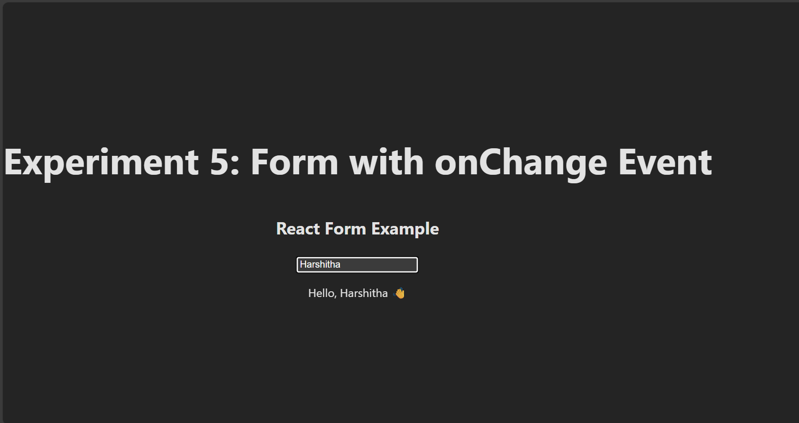

# 📘 Experiment 5: Form with onChange Event to Update State Dynamically (CO2, CO4)

## 🎯 Aim  
Create a form with an input field and handle the `onChange` event to update state dynamically using React.

---
## Screenshots

Here’s a preview of the app:



## 🛠 Steps to Run

### 1. Create a new component `FormComponent.jsx`  
📂 `src/components/FormComponent.jsx`
```jsx
import { useState } from "react";

function FormComponent() {
  // State for storing input value
  const [name, setName] = useState("");

  // Handle input change
  const handleChange = (event) => {
    setName(event.target.value);
  };

  return (
    <div style={{ textAlign: "center", marginTop: "50px" }}>
      <h2>React Form Example</h2>
      <input
        type="text"
        placeholder="Enter your name"
        value={name}
        onChange={handleChange}
      />
      <p>Hello, {name ? name : "Guest"} 👋</p>
    </div>
  );
}

export default FormComponent;
